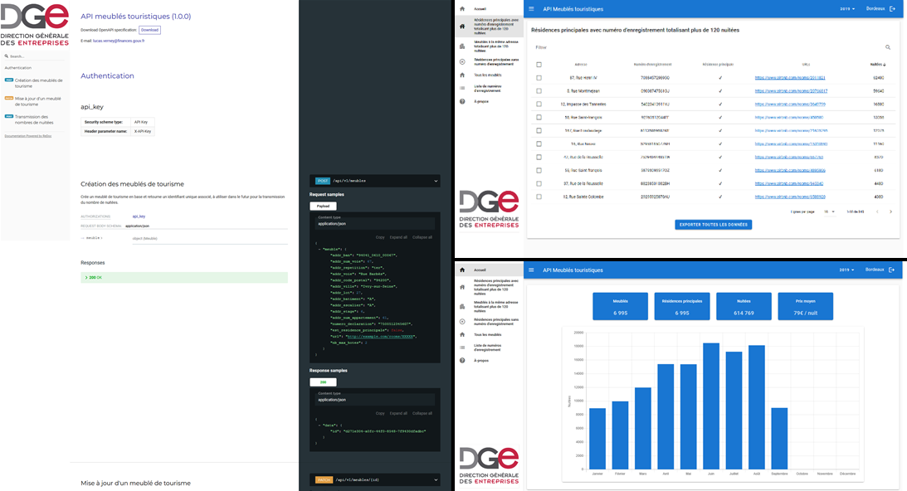

PEReN is an agile organisation and its activities are organised in projects. The 2021 work program was built from the exchanges with the different partner administrations and PEReN is expecting to work on around twenty projects this year. This number will increase as new requests are submitted by partner administrations.

Most of the projects on which PEReN is working are partly or completely confidential and therefore cannot be detailed. Here is a selection of a few projects in which PEReN is currently involved.

## A few projects

### Construction of an API to smooth the implementation of the ELAN law

Due to the French [ELAN][1] law, tourist accommodation rental platforms are bound to share location-related information with municipalities. PEReN has developed a web interface so that collecting and processing this data becomes simpler for all stakeholders. For example, it allows municipalities to easily check whether a main residence is rented for more than 120 days a year. The API of this project is currently being tested in a few cities, with the cooperation of several rental platforms.

<figure class="fr-content-media fr-content-media--sm">
    

        
    

</figure>

### Monitoring the evolution of General Terms and Conditions of Use

PEReN is providing assistance in the development of a tool to monitor the evolution of General Terms and Conditions of Use. Indeed, minor changes sometimes occur without users being notified in the process. In particular, PEReN has extended the scope of the tool to other websites and applications stores, and made it possible to retrieve data in more complex formats. The tool has now been [put online][8] by the [MEAE][2] (Ministry of Foreign Affairs).

<figure class="fr-content-media fr-content-media--sm">
    

        
    

</figure>

### Studies on viral contents

Viral contents are at the heart of news sharing on social networks, and some are engineered to spread fake news, which in turn threaten democratic ecosystems. In this study, PEReN, at the request of the [DGMIC][3] (Media and Cultural industries directorate) and the [CSA][4] (Independent media and broadcasting regulator), is evaluating new tools to detect viral content on social networks, based on the metadata of the messages and their propagation patterns rather than on their contents or the identity of the users. This proof of concept aims at avoiding or minimizing personal data processing and providing an alternative to complex analyses.

<figure class="fr-content-media fr-content-media--sm">
    

        
    

</figure>

### Application test bench

PEReN is developing an experimental tool to automate analyses on services that only present their information through their smartphone apps. A practical use of the tool could be, for example, to enable analyses on Over The Top (OTT) messaging applications, such as instant messaging applications, whose use has sharply increased in recent years, without many studies being conducted on the quality and availability of these services.

### Minimisation of data obtained through portability

Under the [GDPR][9] (General Data Protection Regulation), users of a digital platform can request a copy of their personal data. PEReN, in cooperation with the [CNIL][6] (French personal data protection authority), is developing a tool to anonymise and process this data, so that an administration can, in the future, retrieve insightful information on an economic sector from data voluntarily shared by users, without accessing their personal data.

<figure class="fr-content-media fr-content-media--sm">
    

        
    

</figure>

### Black-box auditing of algorithms

Algorithms are at the core of platform models, be it for web searches, recommendations, pricing or product classification. Yet, the way these algorithms actually work often remains blurred at best, without the possibility of correctly analysing them and the parameters actually taken into account in their computing.

PEReN is working on an innovative way of developing and implementing an auditing method known as black-box auditing, based on statistical analysis of inputs and outputs to infer critical operating principles of an algorithm. The objective of this project is to determine whether this approach provides precise enough results to avoid the processing costs for regulators and platforms that incur by accessing and analysing the source code.

The methodological framework to assess the relevance of these auditing tools is being developed in collaboration with [Inria][5] (National Institute for Research in Digital Science and Technology) and its REGALIA pole, and is designed to foster partnerships with major digital platforms.

### End of third-party cookies

Several digital platforms have announced the end of third-party cookies and their replacement by a new system to provide online targeted advertising. PEReN is leading a working group of various public authorities and government bodies that is undertaking a technical analysis of these new methods, to provide each member with a technical analysis and a better understanding of the impact of this major change on the advertising ecosystem. The various public authorities contributing to the project will then be able to use these technical analyses to assess independently - each in their own field of expertise or jurisdiction - the consequences of the announced end of third-party cookies.

<figure class="fr-content-media fr-content-media--sm">
    

        
    

</figure>

[1]: https://www.legifrance.gouv.fr/jorf/id/JORFTEXT000037639478/
[2]: https://www.diplomatie.gouv.fr/fr/
[3]: https://www.culture.gouv.fr/Nous-connaitre/Organisation/La-direction-generale-des-medias-et-des-industries-culturelles
[4]: https://www.csa.fr/
[5]: https://inria.fr/en
[6]: https://www.cnil.fr/
[7]: https://www.entreprises.gouv.fr/fr
[8]: https://www.diplomatie.gouv.fr/fr/politique-etrangere-de-la-france/diplomatie-numerique/blog-de-l-equipe/article/open-terms-archive-scripta-manent
[9]: https://gdpr.eu/
[10]: https://www.amf-france.org/fr/actualites-publications/actualites/gamestop-mania-retour-sur-un-phenomene-de-marche
[11]: https://www.amf-france.org/fr
