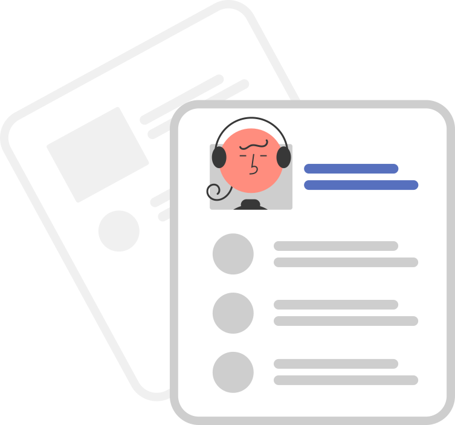

Vous avez envie de mettre vos compétences dans le numérique au service de l’intérêt général et de rejoindre une équipe en pleine croissance ? Le PEReN recrute !

Nous publions régulièrement sur cette page les nouvelles offres disponibles.

## Nos offres en cours

    

        

            

                
            

            

                <h4 class="fr-tile__title"><a class="fr-tile__link" href="https://passerelles.economie.gouv.fr/offre-de-emploi/emploi-developpeur-front-end-sen-peren-155-h-f_4165.aspx">Développeur / Développeuse <em lang="en">front</em></a></h4>
            

        

    

    

        

            

                
            

            

                <h4 class="fr-tile__title"><a class="fr-tile__link" href="https://www.passerelles.economie.gouv.fr/offre-de-emploi/emploi-specialiste-en-traitement-de-l-image-et-ia-computer-vision-data-scientist-sen-peren-156-h-f_4207.aspx">Spécialiste en traitement de l'image et IA (<em lang="en">Computer Vision data scientist</em>)</a></h4>
            

        

    

## Comment fonctionne le processus de recrutement ?

### 1. Je postule

Afin d’accompagner la forte croissance du service, nous postons régulièrement des offres sur le site. Une d’entre elles vous intéresse ? N’hésitez plus et postulez sur [Passerelles][1] ou [Place de l'Emploi Public][2]. Les offres de stages sont disponibles sur [PASS][3].

Le PEReN étant à la recherche de profils pointus, il peut arriver que vous ne remplissiez pas tous les prérequis exigés : ne vous autocensurez pas pour autant ! Après avoir postulé, vous recevrez un courriel de confirmation et notre équipe examinera votre candidature.

[1]: https://passerelles.economie.gouv.fr
[2]: https://place-emploi-public.gouv.fr/
[3]: https://www.pass.fonction-publique.gouv.fr/

### 2. Examen des candidatures

Nous considérons que si vous avez pris le temps de postuler, il est naturel de donner toutes ses chances à votre candidature. Elle sera examinée par au moins deux membres de l’équipe du PEReN, en fonction de la nature du profil recherché.

Si votre candidature nous paraît en adéquation avec le poste, vous serez recontacté pour un entretien.

### 3. Entretien

Le but de l’entretien, qui a lieu avec les membres du PEReN qui ont évalué votre candidature, est de construire un échange avec vous. Cela nous permet d’apprendre à vous connaître, de comprendre les motivations qui vous ont poussé à postuler et de vérifier que vos compétences techniques correspondent bien à ce que nous recherchons.

L’entretien n’est pas là pour vous piéger ! N’oubliez pas que les personnes avec qui vous échangez sont celles qui ont choisi votre candidature parce qu’elles pensent que vous avez le bon profil.

Le meilleur conseil qu’on peut donc vous donner est : restez vous-même !

### 4.	Quand est-ce-que j’aurai une réponse définitive ?

Il peut arriver que la réponse tarde à venir, mais cela ne veut pas dire que votre candidature n’a pas été retenue. En effet, nous nous attachons à laisser des délais suffisants après publication d'une offre pour lui assurer une bonne publicité. Il est donc possible que vous ne receviez pas une réponse immédiatement, même si vous êtes le candidat parfait. A cela s’ajoute le fait qu’évaluer des candidatures avec rigueur est un long processus, surtout lorsqu’on en reçoit beaucoup. Soyez patient et nous essaierons de revenir au plus vite vers vous !
